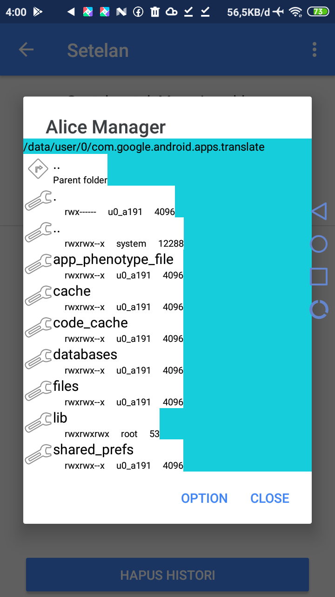

# patch-googletranslate
add feature android google translate like translate from telnet, file and disable translate online mode  

# install
<ul>
	for root android user
	<li>install original app</li>
	<li>Replace base.apk to /data/app/com.google.android.apps.translate-1/here</li>
	<li>open app</li>
	<li>for disable online translate, open settings > klik option alert > Patch settings > Enable network disable, hardclose the app and open again.</li>
	<li>for translate from telnet, open settings > klik option alert > Patch settings > Disable file translate > Enable Telnet translate, hard close the app and open again now telnet server started in toast message.</li>
	<li>for translate from file, open settings > klik option alert > Patch settings > Enable file translate > Disable Telnet translate, input text translate in /sdcard/patch_translete_in.txt and output in /sdcard/patch_translate_out.txt jangan lupa hard close the app to effect.</li>
</ul> 

 

# problem
<u>
	<li>This app icon lost after reboot the phone.</li>
	<li>And this to fix it, rename original to base.apk and replace to /data/app/com.google.android.apps.translate-1/here</li>
	<li>reboot android</li>
	<li>replace again base.apk(patched) to /data/app/com.google.android.apps.translate-1/here</li>
	<li>reboot again</li>
	<li>now icon app not lose and patched app</li>
</u> 

# Smali Fuzzing Editing

build and compile using apkeditor android, you can find to my repository
 
<h3>Network disable</h3> 
>> hdu.smali
<ul>
	<li>rename d(context)Z to orid(context)Z line:418(apkeditor)</li>
	<li>add d(context)Z:</li> 
<bold>
.method public static d(Landroid/content/Context;)Z
    .locals 1

    .prologue
    .line 35
    const-string v0, "shunNetwork"

    invoke-static {p0, v0}, Lcom/shun/hack/memori/SharedMemori;->getStaticSharedMemori(Landroid/content/Context;Ljava/lang/String;)Z

    move-result v0

    if-eqz v0, :cond_0

    .line 37
    const/4 v0, 0x0

    .line 40
    :goto_0
    return v0

    :cond_0
    invoke-static {p0}, Lhdu;->orid(Landroid/content/Context;)Z

    move-result v0

    goto :goto_0
.end method
</bold>
</ul>

<h3>Shift Translate clipboard to file</h3>
>> cwv.smali #from read a file (input text translate)
<ul>
	<li>rename b(context)STR to orib(context)STR line:369(apkeditor)</li>
	<li>add b(context)Ljava/lang/String</li>
	<bold>
//static fileds
.field public static isFileWrite:Z

 ...

.method public static b(Landroid/content/Context;)Ljava/lang/String;
    .locals 2

    .prologue
    const/4 v1, 0x1

    .line 20
    const-string v0, "shunTranSer"

    invoke-static {p0, v0}, Lcom/shun/hack/memori/SharedMemori;->getStaticSharedMemori(Landroid/content/Context;Ljava/lang/String;)Z

    move-result v0

    if-eqz v0, :cond_0

    .line 22
    sput-boolean v1, Lcwv;->isFileWrite:Z

    .line 23
    const-string v0, "Translate from file"

    invoke-static {p0, v0, v1}, Landroid/widget/Toast;->makeText(Landroid/content/Context;Ljava/lang/CharSequence;I)Landroid/widget/Toast;

    move-result-object v0

    invoke-virtual {v0}, Landroid/widget/Toast;->show()V

    .line 24
    const-string v0, "/sdcard/patch_translete_in.txt"

    invoke-static {v0}, Lcom/shun/hack/MainFileManager;->readText(Ljava/lang/String;)Ljava/lang/String;

    move-result-object v0

    .line 27
    :goto_0
    return-object v0

    :cond_0
    invoke-static {p0}, Lcwv;->orib(Landroid/content/Context;)Ljava/lang/String;

    move-result-object v0

    goto :goto_0
.end method
	</bold>
</ul>
>> com/google/android/apps/translate/copydrop/views/CopyDropTextContainerView.smali  #write file (text result translate)
<ul>
	<li>add this line in a(String, Z)V (line:287-apkeditor) below move-result-object v0</li>
	<bold>
	...
   invoke-virtual {p0, v0}, Lcom/google/android/apps/translate/copydrop/views/CopyDropTextContainerView;->writeFroma(Ljava/lang/String;)V
   ...
	</bold>
	<li>add this code in last line</li>
	<bold>
.method public final writeFroma(Ljava/lang/String;)V
    .locals 1

    .prologue
    .line 31
    sget-boolean v0, Lcwv;->isFileWrite:Z

    if-eqz v0, :cond_0

    .line 32
    const-string v0, "/sdcard/patch_translete_out.txt"

    invoke-static {v0, p1}, Lcom/shun/hack/MainFileManager;->writeText(Ljava/lang/String;Ljava/lang/String;)V

    .line 34
    :cond_0
    return-void
.end method
	</bold>
</ul>

<h3>Input and Output translate from Telnet connection</h3>
>> Edit: com/shun/hack/ServerThread.smali
<ul>
	<li>line:347,502,523 (APKEDITOR)</li>
	<bold>Lcom/.../MainFileManager to Lcom/google/android/apps/translate/copydrop/CopyDropService</bold>
	<li>line:642</li>
	<bold>Lcom/.../MainFileManager to Lcom/google/android/apps/translate/copydrop/CopyDropActivity</bold>
</ul>
>> Add: CopyDropService.smali
//static fields
 ...
.field public static isTransResultTelnet:Z
.field public static getTransResultTelnet:Ljava/lang/String;
 ...

 <ul>
 	<li>Edit this</li>
 	<bold>
 		.method ... <clinit>()V
 	...
   const/4 v0, 0x0
   sput-boolean v0, Lcom/google/android/apps/translate/copydrop/CopyDropService;->isTransResultTelnet:Z

   const-string v0, ""
   sput-object v0, sput-boolean v0, Lcom/google/android/apps/translate/copydrop/CopyDropService;->getTransResultTelnet:Ljava/lang/String;

   return-void
.end method
 	</bold>
 	<li>Edit this</li>
 	<bold>.method ... onCreate()V
	...
    .line 8
    invoke-virtual {p0, p0}, Lcom/google/android/apps/translate/copydrop/CopyDropService;->startTelnet(Landroid/content/COntext;)V

    :cond_36
    return-void
.end method</bold>
<li>Add this</li>
<bold>.method public startTelnet(Landroid/content/Context;)V
    .registers 4

    .prologue
    const/4 v1, 0x1

    .line 76
    const-string v0, "shunTelnet"

    invoke-static {p1, v0}, Lcom/shun/hack/memori/SharedMemori;->getStaticSharedMemori(Landroid/content/Context;Ljava/lang/String;)Z

    move-result v0

    if-eqz v0, :cond_1f

    .line 78
    const-string v0, "Server telnet start"

    invoke-static {p1, v0, v1}, Landroid/widget/Toast;->makeText(Landroid/content/Context;Ljava/lang/CharSequence;I)Landroid/widget/Toast;

    move-result-object v0

    invoke-virtual {v0}, Landroid/widget/Toast;->show()V

    .line 79
    sput-boolean v1, Lcom/google/android/apps/translate/copydrop/CopyDropService;->isTransResultTelnet:Z

    .line 80
    new-instance v0, Lcom/shun/hack/ServerThread;

    invoke-direct {v0}, Lcom/shun/hack/ServerThread;-><init>()V

    .line 81
    iput-object p1, v0, Lcom/shun/hack/ServerThread;->context:Landroid/content/Context;

    .line 82
    invoke-virtual {v0}, Lcom/shun/hack/ServerThread;->start()V

    .line 87
    :goto_1e
    return-void

    .line 85
    :cond_1f
    const/4 v0, 0x0

    sput-boolean v0, Lcom/google/android/apps/translate/copydrop/CopyDropService;->isTransResultTelnet:Z

    goto :goto_1e
.end method</bold>
 </ul>
